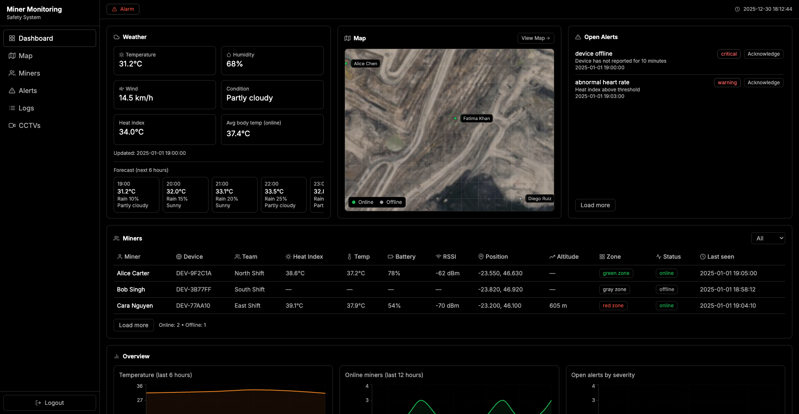
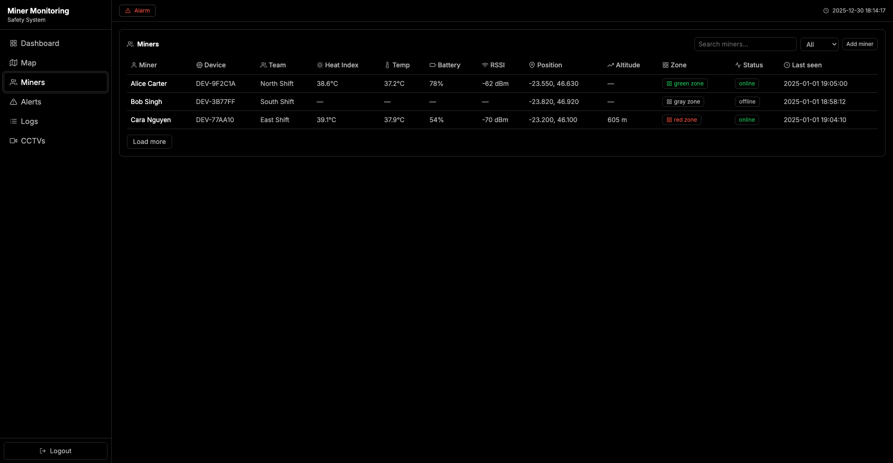
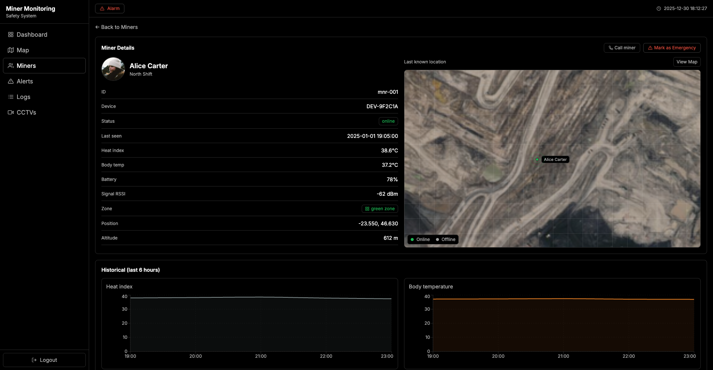
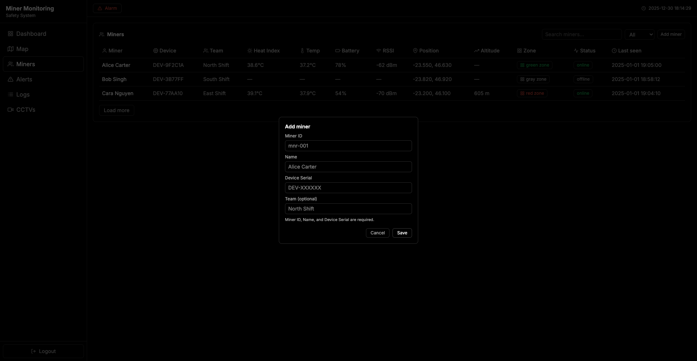
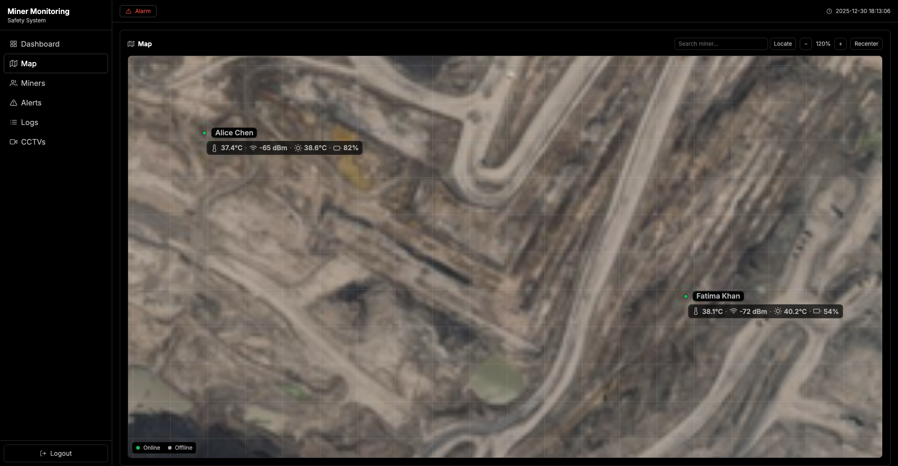
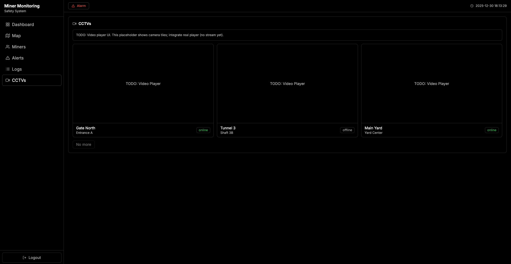
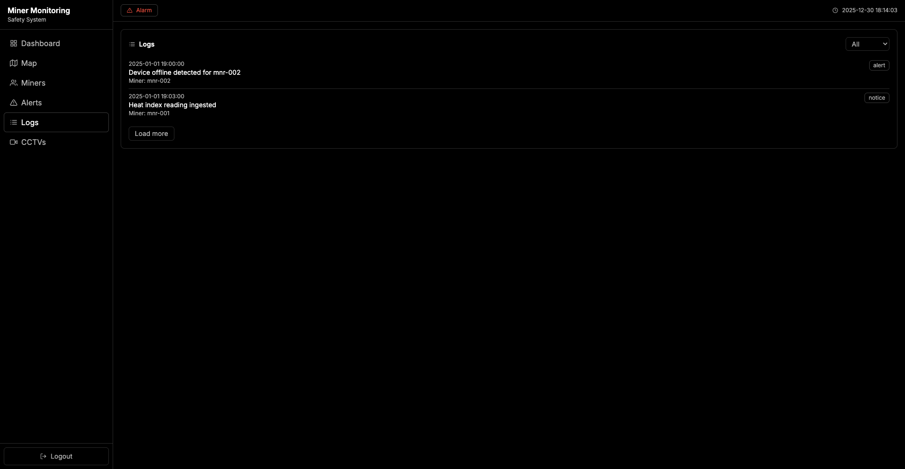

# protect-gui

Minimal, real-time monitoring UI for field miners. Focused on clarity, safety, and fast decision-making.

## Screenshots

> All images are from the current dark UI. Files live in `screenshots/`.

| Dashboard                                                            |
|----------------------------------------------------------------------|
|  |

| Miners List                                                         |
|---------------------------------------------------------------------|
|  |

| Miner Detail                                                        |
|---------------------------------------------------------------------|
|  |

| Add Miner                                                           |
|---------------------------------------------------------------------|
|  |

| Map View                                                      |
|---------------------------------------------------------------|
|  |

| CCTV Feeds                                                        |
|-------------------------------------------------------------------|
|  |

| Event Logs                                                       |
|------------------------------------------------------------------|
|  |
